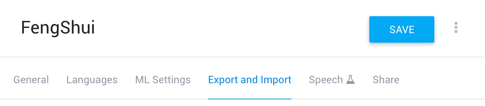
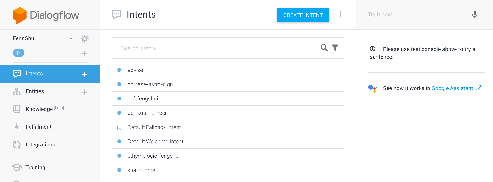
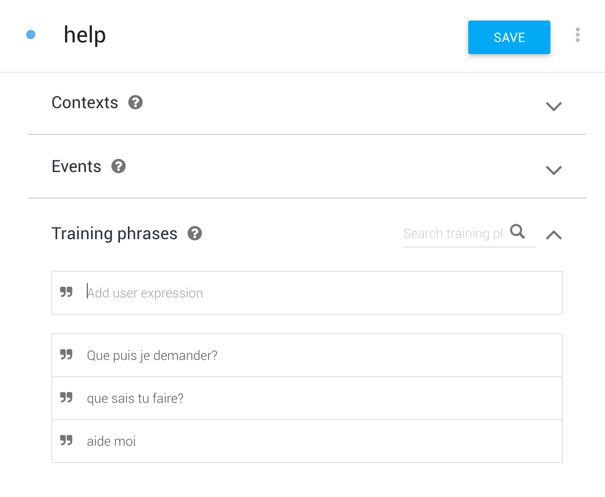
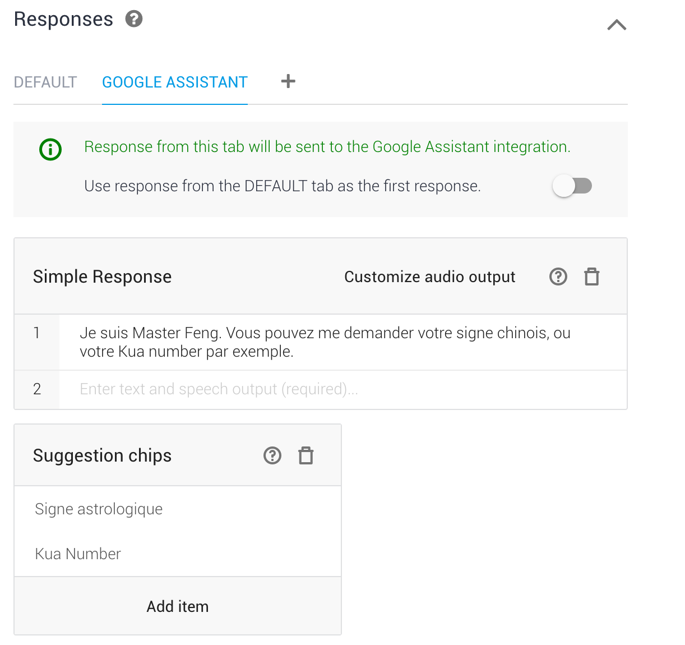
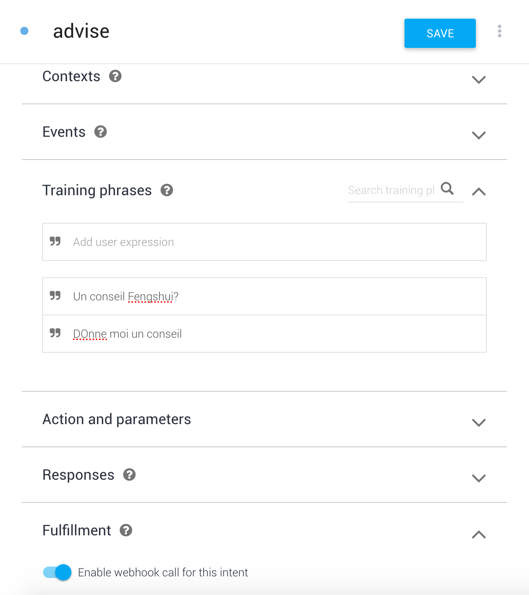
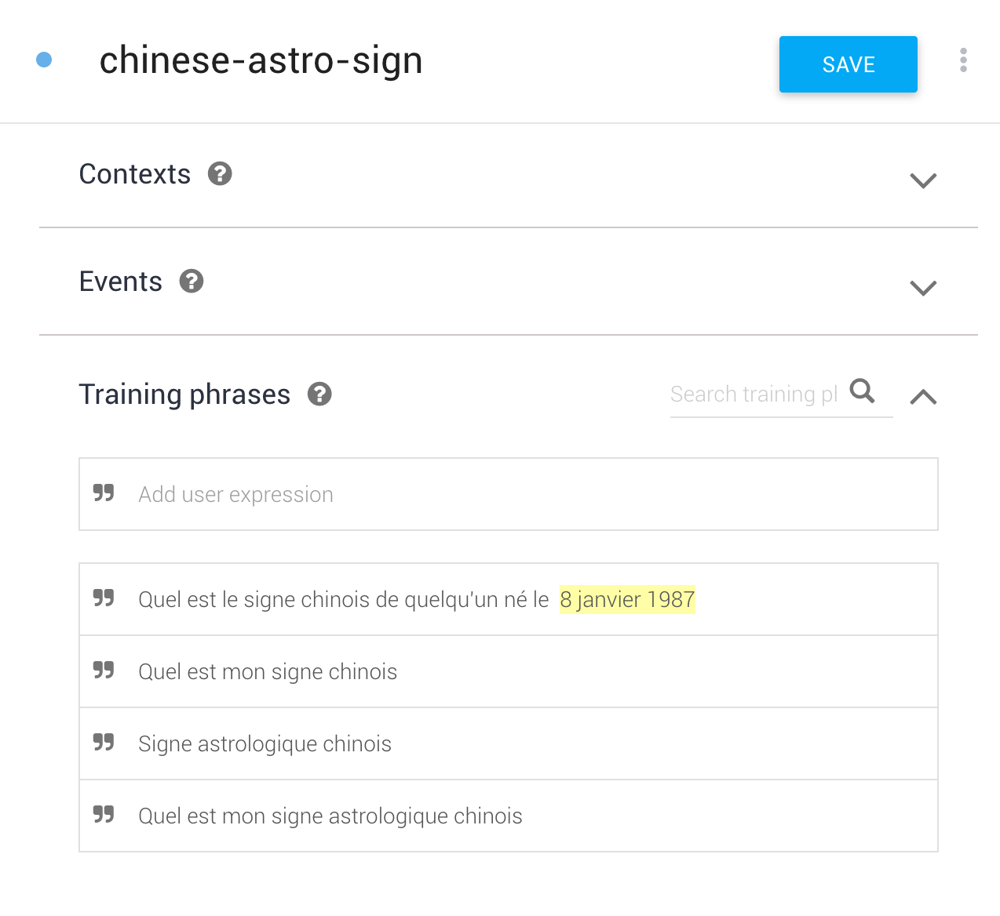
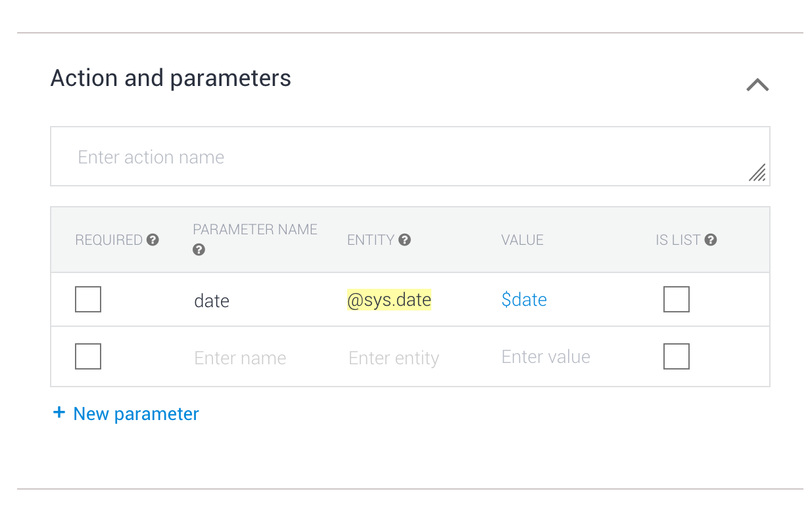

# Dialog flow part
Action Fengshui works with DIlaogflow.

## Create account
The official doc is (here)[https://dialogflow.com/docs/getting-started/create-account].

## Create Fengshui project
The official doc is (here)[https://dialogflow.com/docs/getting-started/first-agent].

## Import project
1. Go to your project settings on the right

2. Choose Export and import tab

3. Finally _restore from ZIP_ and select the (Fengshui.zip)[../dialogflow/FengShui.zip] available in dialogflow folder.

Now, you Dialogflow project is fully configured. You can see all the available intents.

## Intents
### Help
Help intent is the simplest. It has *no fullfilment*. Dialogflow receives the user sentences, detects the associated intent, and send the associated responses. 

The training phrase below, describe the way Dialogflow will trigger this intent. 

Then, Dialogflow will anwser with this response.

There is multiple stuff to see here:
1. There is two tabs: Default and Google Assistant.
The one is a default response for Dialogflow test and the other is for Google Assistant only. 
2. _Use response from the DEFAULT tab as the first response" triggers allow you to send the responses from _default tab_ to all the other medium, like Google Assistant. 
3. In Google Assistant, you have access to all the Assistant _widget_: SimpleResponse, SuggestionChips, MediaObject, ... For the help intent, I provide a simple response and suggestions chips. Chips enable user to answer in one click. 

### Advise

These

### Chinese sign

